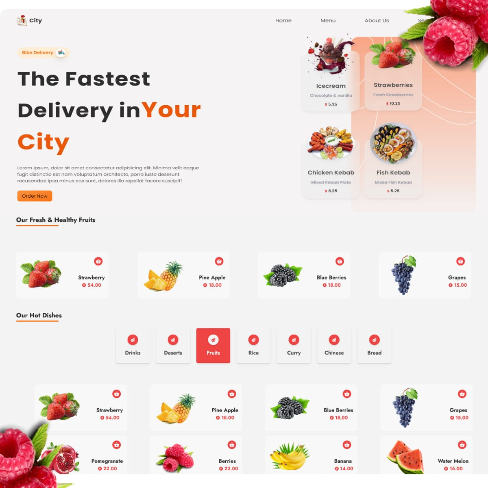

> FullStack Food Delivery Application using Reactjs
> [Follow Me](https://arunrajportfolio.vercel.app/)



# To check the node version

```
node --version
```

# To intialize the Firebase console

```
firebase init
```

# To start the server

```
npm run serve
```

# To create react project using npm

```
npx create-react-app folder_name
```

# To start the client 

```
npm start
```

# To initialize firebase

```
firebase init
```

# To login & logout firebase

```
firebase login
```

```
firebase logout
```
## Express 

```
npm i express
```

# for run server
```
npm run serve
```
# Redux

```
npm i redux
```

```
npm i react-redux
```

# Material table

```
npm install material-table --save
```

```
npm install material-table --legacy-peer-deps
```

```
npm install @mui/lab --force
npm install @mui/material@latest-version
npm install @emotion/react@latest-version
npm install @emotion/styled@latest-version
```

## Tailwind css

# install scrollbar

```
npm i tailwind-scrollbar
```

# Firebase